# 📘 PRD - WhatAutosys Admin Dashboard
*Product Requirements Document - Version 1.0 - 23/12/2025*

---

## 🎯 RÉSUMÉ EXÉCUTIF

**Objectif :** Créer une interface web d'administration pour gérer l'écosystème WhatAutosys : licences, utilisateurs, abonnements, support et analytics.

**Utilisateurs cibles :**
- Administrateurs système
- Équipe support
- Management (vision business)

**Fonctionnalités clés :**
1. Gestion des licences (création, renouvellement, révocation)
2. Monitoring utilisateurs en temps réel
3. Dashboard analytics (revenue, usage, conversions)
4. Gestion des abonnements Stripe
5. Support client intégré
6. Logs système centralisés

---

## 📋 TABLE DES MATIÈRES

1. [Vue d'ensemble stratégique](#1-vue-densemble-stratégique)
2. [Personas & Cas d'usage](#2-personas--cas-dusage)
3. [Architecture technique](#3-architecture-technique)
4. [Spécifications fonctionnelles](#4-spécifications-fonctionnelles)
5. [Sécurité & Conformité](#5-sécurité--conformité)
6. [Roadmap de développement](#6-roadmap-de-développement)

---

## 1. 🎯 VUE D'ENSEMBLE STRATÉGIQUE

### A. Vision Produit

L'Admin Dashboard est le **centre de contrôle** de l'écosystème WhatAutosys. Il permet à l'équipe de :
- ✅ Gérer le cycle de vie complet des licences
- ✅ Monitorer la santé des clients (usage, bugs, churn)
- ✅ Optimiser les revenus (upsells, renewals)
- ✅ Fournir un support proactif

### B. Objectifs Business (KPIs)

| Métrique | Objectif Q1 2026 | Impact |
|----------|------------------|--------|
| **Temps de résolution support** | <2h | Satisfaction client +30% |
| **Taux de renouvellement** | >85% | MRR stable |
| **Détection churn précoce** | 7 jours avant expiration | Rétention +20% |
| **Temps création licence** | <30 secondes | Efficacité opérationnelle |

### C. Stack Technique Proposée

```
Frontend : React + Tailwind + Recharts
Backend : Node.js + Express
Database : PostgreSQL
Auth : JWT + 2FA
Monitoring : Prometheus + Grafana
Hosting : VPS (auto-hébergé) ou Vercel
```

---

## 2. 👥 PERSONAS & CAS D'USAGE

### Persona 1 : "Laura, Administratrice Système"
**Profil :**
- 28 ans, tech lead
- Gère l'infrastructure et les licences
- Technique : Expert

**Besoins :**
- Créer des licences en masse (50+ par jour)
- Révoquer une licence instantanément si fraude détectée
- Voir les logs d'erreurs système en temps réel

**User Story :**
> "En tant qu'admin, je veux créer 100 licences d'un coup via import CSV pour pouvoir gérer rapidement un lancement Black Friday."

---

### Persona 2 : "Marc, Agent Support"
**Profil :**
- 24 ans, support niveau 1
- Répond aux tickets clients
- Technique : Intermédiaire

**Besoins :**
- Voir l'historique complet d'un client (paiements, bugs, conversations)
- Prolonger une licence manuellement (geste commercial)
- Accéder aux logs d'erreurs d'un utilisateur spécifique

**User Story :**
> "En tant qu'agent support, je veux voir pourquoi le client X a des erreurs de connexion WhatsApp sans lui demander des screenshots."

---

### Persona 3 : "Sophie, Business Manager"
**Profil :**
- 35 ans, responsable produit
- Analyse les métriques business
- Technique : Débutante

**Besoins :**
- Dashboard revenue (MRR, churn, LTV)
- Segmentation des utilisateurs (actifs, inactifs, churned)
- Rapports export Excel

**User Story :**
> "En tant que manager, je veux voir notre MRR et taux de churn sur les 3 derniers mois pour ajuster notre stratégie pricing."

---

## 3. 🏗️ ARCHITECTURE TECHNIQUE

### A. Diagramme d'Architecture

```mermaid
graph TB
    Admin[👤 Admin Users] -->|HTTPS + JWT| WebApp[React Admin SPA]
    
    WebApp -->|REST API| Backend[Node.js Backend]
    
    Backend -->|Read/Write| DB[(PostgreSQL)]
    Backend -->|Webhooks| Stripe[Stripe API]
    Backend -->|Send Emails| SendGrid[SendGrid]
    Backend -->|Query| Logs[(Logs DB)]
    
    ClientApp[📱 WhatAutosys Client] -->|Report Stats| Backend
    ClientApp -->|License Check| Backend
    
    Backend -->|Metrics| Prometheus[Prometheus]
    Prometheus -->|Visualize| Grafana[Grafana Dashboard]
```



### B. Base de Données (PostgreSQL)

```sql
-- Table des licences
CREATE TABLE licenses (
    id UUID PRIMARY KEY DEFAULT gen_random_uuid(),
    license_key VARCHAR(100) UNIQUE NOT NULL,
    hwid VARCHAR(200) NOT NULL,
    email VARCHAR(255) NOT NULL,
    plan VARCHAR(50) NOT NULL, -- starter, premium, enterprise
    status VARCHAR(50) DEFAULT 'active', -- active, grace_period, expired, revoked
    issued_at TIMESTAMP NOT NULL DEFAULT NOW(),
    expires_at TIMESTAMP NOT NULL,
    auto_renew BOOLEAN DEFAULT true,
    stripe_subscription_id VARCHAR(100),
    created_by UUID REFERENCES users(id),
    notes TEXT,
    last_check_in TIMESTAMP, -- Dernière connexion du client
    client_version VARCHAR(20),
    created_at TIMESTAMP DEFAULT NOW(),
    updated_at TIMESTAMP DEFAULT NOW()
);

-- Table des utilisateurs admin
CREATE TABLE users (
    id UUID PRIMARY KEY DEFAULT gen_random_uuid(),
    email VARCHAR(255) UNIQUE NOT NULL,
    password_hash VARCHAR(255) NOT NULL,
    role VARCHAR(50) NOT NULL, -- admin, support, viewer
    two_factor_enabled BOOLEAN DEFAULT false,
    two_factor_secret VARCHAR(100),
    last_login TIMESTAMP,
    created_at TIMESTAMP DEFAULT NOW()
);

-- Table des paiements
CREATE TABLE payments (
    id UUID PRIMARY KEY DEFAULT gen_random_uuid(),
    license_id UUID REFERENCES licenses(id),
    stripe_payment_id VARCHAR(100),
    amount INTEGER NOT NULL, -- En centimes
    currency VARCHAR(3) DEFAULT 'EUR',
    status VARCHAR(50), -- succeeded, failed, pending
    payment_date TIMESTAMP DEFAULT NOW(),
    metadata JSONB
);

-- Table des événements (audit log)
CREATE TABLE events (
    id UUID PRIMARY KEY DEFAULT gen_random_uuid(),
    license_id UUID REFERENCES licenses(id),
    user_id UUID REFERENCES users(id),
    event_type VARCHAR(100) NOT NULL, -- license_created, license_revoked, payment_failed, etc.
    event_data JSONB,
    ip_address INET,
    user_agent TEXT,
    created_at TIMESTAMP DEFAULT NOW()
);

-- Table des métriques d'usage
CREATE TABLE usage_stats (
    id UUID PRIMARY KEY DEFAULT gen_random_uuid(),
    license_id UUID REFERENCES licenses(id),
    date DATE NOT NULL,
    messages_sent INTEGER DEFAULT 0,
    ai_queries INTEGER DEFAULT 0,
    campaigns_launched INTEGER DEFAULT 0,
    errors_count INTEGER DEFAULT 0,
    uptime_minutes INTEGER DEFAULT 0,
    created_at TIMESTAMP DEFAULT NOW(),
    UNIQUE(license_id, date)
);

-- Table des tickets support
CREATE TABLE support_tickets (
    id UUID PRIMARY KEY DEFAULT gen_random_uuid(),
    license_id UUID REFERENCES licenses(id),
    subject VARCHAR(255) NOT NULL,
    description TEXT,
    status VARCHAR(50) DEFAULT 'open', -- open, in_progress, resolved, closed
    priority VARCHAR(50) DEFAULT 'medium', -- low, medium, high, critical
    assigned_to UUID REFERENCES users(id),
    created_at TIMESTAMP DEFAULT NOW(),
    updated_at TIMESTAMP DEFAULT NOW(),
    resolved_at TIMESTAMP
);

-- Index pour performance
CREATE INDEX idx_licenses_email ON licenses(email);
CREATE INDEX idx_licenses_status ON licenses(status);
CREATE INDEX idx_licenses_expires_at ON licenses(expires_at);
CREATE INDEX idx_events_license_id ON events(license_id);
CREATE INDEX idx_usage_stats_date ON usage_stats(date);
```

---

## 4. 🔧 SPÉCIFICATIONS FONCTIONNELLES

### Feature 1 : Dashboard Principal

**Objectif :** Vue d'ensemble en temps réel de l'écosystème.

**Widgets :**

```jsx
<Dashboard>
  {/* KPIs principaux */}
  <StatsCards>
    <StatCard 
      title="MRR (Monthly Recurring Revenue)"
      value="12,450€"
      trend="+8.5%"
      icon={<TrendingUp />}
    />
    <StatCard 
      title="Licences Actives"
      value="423"
      subtitle="Sur 500 total"
      icon={<Key />}
    />
    <StatCard 
      title="Taux de Renouvellement"
      value="87%"
      trend="+3%"
      icon={<Repeat />}
    />
    <StatCard 
      title="Support Tickets Ouverts"
      value="12"
      urgency="medium"
      icon={<AlertCircle />}
    />
  </StatsCards>
  
  {/* Graphiques */}
  <Row>
    <RevenueChart 
      data={monthlyRevenue}
      period="3 mois"
    />
    <ChurnChart 
      data={churnData}
      alert={churnRate > 15}
    />
  </Row>
  
  {/* Alertes critiques */}
  <AlertsPanel>
    <Alert type="warning">
      18 licences expirent dans les 7 prochains jours
    </Alert>
    <Alert type="error">
      3 paiements Stripe ont échoué aujourd'hui
    </Alert>
  </AlertsPanel>
  
  {/* Activité récente */}
  <RecentActivity>
    <ActivityItem>
      <User>laura@admin.com</User> a créé 
      <Count>5</Count> nouvelles licences
      <Time>Il y a 2h</Time>
    </ActivityItem>
  </RecentActivity>
</Dashboard>
```

**Critères d'acceptation :**
- [ ] Rafraîchissement automatique toutes les 30s
- [ ] Export des données en CSV/PDF
- [ ] Filtres par période (7j, 30j, 90j, custom)
- [ ] Vue responsive (mobile-friendly)

---

### Feature 2 : Gestion des Licences

**Objectif :** CRUD complet des licences avec actions avancées.

**Interface principale :**

```jsx
<LicensesPage>
  {/* Barre d'actions */}
  <ActionBar>
    <Button primary onClick={createLicense}>
      + Nouvelle Licence
    </Button>
    <Button onClick={importCSV}>
      📥 Import CSV
    </Button>
    <SearchBar 
      placeholder="Rechercher par email, HWID, licence..."
      onChange={handleSearch}
    />
    <Filters>
      <Select name="status" options={['Tous', 'Active', 'Expirée', 'Révoquée']} />
      <Select name="plan" options={['Tous', 'Starter', 'Premium', 'Enterprise']} />
    </Filters>
  </ActionBar>
  
  {/* Table des licences */}
  <LicensesTable>
    <thead>
      <th>Email</th>
      <th>Plan</th>
      <th>Statut</th>
      <th>Expire le</th>
      <th>MRR</th>
      <th>Dernière connexion</th>
      <th>Actions</th>
    </thead>
    <tbody>
      <tr>
        <td>client@example.com</td>
        <td><Badge>Premium</Badge></td>
        <td><StatusBadge status="active">Active</StatusBadge></td>
        <td>15/02/2025 <TimeLeft>(22 jours)</TimeLeft></td>
        <td>29€</td>
        <td>Il y a 3h</td>
        <td>
          <DropdownMenu>
            <MenuItem onClick={viewDetails}>👁️ Détails</MenuItem>
            <MenuItem onClick={extendLicense}>⏰ Prolonger</MenuItem>
            <MenuItem onClick={changePlan}>🔄 Changer plan</MenuItem>
            <MenuItem onClick={revokeLicense} danger>🚫 Révoquer</MenuItem>
          </DropdownMenu>
        </td>
      </tr>
    </tbody>
  </LicensesTable>
  
  {/* Pagination */}
  <Pagination current={1} total={43} perPage={20} />
</LicensesPage>
```

**Modal de création de licence :**

```jsx
<CreateLicenseModal>
  <Form>
    <Input 
      name="email" 
      label="Email client"
      type="email"
      required
    />
    
    <Input 
      name="hwid" 
      label="Hardware ID (HWID)"
      placeholder="Copier depuis la machine du client"
      required
    />
    
    <Select 
      name="plan" 
      label="Plan"
      options={[
        { value: 'starter', label: 'Starter - 19€/mois' },
        { value: 'premium', label: 'Premium - 29€/mois' },
        { value: 'enterprise', label: 'Enterprise - 99€/mois' }
      ]}
    />
    
    <DatePicker 
      name="expires_at"
      label="Date d'expiration"
      defaultValue={new Date() + 30 days}
    />
    
    <Checkbox 
      name="auto_renew"
      label="Renouvellement automatique"
      defaultChecked
    />
    
    <Select 
      name="payment_method"
      label="Méthode de paiement"
      options={['Stripe', 'PayPal', 'Virement', 'Manuel (geste commercial)']}
    />
    
    <Textarea 
      name="notes"
      label="Notes internes"
      placeholder="Ex: Client Black Friday 2024, -50%"
    />
    
    <ButtonGroup>
      <Button secondary onClick={cancel}>Annuler</Button>
      <Button primary onClick={createAndSend}>
        Créer et envoyer par email
      </Button>
    </ButtonGroup>
  </Form>
</CreateLicenseModal>
```

**Actions avancées :**

1. **Prolonger une licence**
   ```jsx
   <ExtendLicenseModal>
     <p>Licence actuelle expire le: <strong>15/02/2025</strong></p>
     <Select label="Prolonger de">
       <option>7 jours</option>
       <option>15 jours</option>
       <option>30 jours</option>
       <option>Custom...</option>
     </Select>
     <Textarea label="Raison" placeholder="Geste commercial suite au bug du 23/12" />
     <Button>Prolonger</Button>
   </ExtendLicenseModal>
   ```

2. **Révoquer une licence**
   ```jsx
   <RevokeLicenseModal>
     <Alert type="danger">
       ⚠️ Cette action est irréversible. Le client perdra immédiatement l'accès.
     </Alert>
     <Select label="Raison">
       <option>Fraude détectée</option>
       <option>Paiement rejeté (>30 jours)</option>
       <option>Demande du client</option>
       <option>Autre...</option>
     </Select>
     <Checkbox label="Envoyer un email au client" />
     <Input type="password" placeholder="Tapez REVOQUER pour confirmer" />
     <Button danger>Révoquer définitivement</Button>
   </RevokeLicenseModal>
   ```

3. **Import CSV en masse**
   ```csv
   email,hwid,plan,notes
   client1@example.com,HWID123,premium,Black Friday -30%
   client2@example.com,HWID456,starter,Parrainage Sophie
   ```

**Critères d'acceptation :**
- [ ] Création de licence en <30s
- [ ] Import CSV de 100+ licences en <2min
- [ ] Tous les champs obligatoires validés
- [ ] Email automatique envoyé au client
- [ ] Génération du fichier `license.key` disponible en téléchargement
- [ ] Logs de toutes les actions (audit trail)

---

### Feature 3 : Détails d'une Licence

**Objectif :** Vue 360° d'un client.

```jsx
<LicenseDetailPage>
  {/* Header */}
  <Header>
    <Avatar email={license.email} />
    <div>
      <h1>{license.email}</h1>
      <p>Client depuis le {license.created_at}</p>
      <StatusBadge status={license.status} />
    </div>
    <ActionButtons>
      <Button onClick={contactClient}>📧 Contacter</Button>
      <Button onClick={loginAs}>🔐 Login as</Button>
    </ActionButtons>
  </Header>
  
  {/* Tabs */}
  <Tabs>
    {/* Tab 1: Informations */}
    <Tab label="Informations">
      <InfoGrid>
        <InfoCard title="Plan" value="Premium" action="Changer" />
        <InfoCard title="MRR" value="29€" />
        <InfoCard title="LTV" value="348€" subtitle="12 mois d'abonnement" />
        <InfoCard title="Expire le" value="15/02/2025" urgent />
        <InfoCard title="Auto-renouvellement" value="Activé ✓" />
        <InfoCard title="Stripe ID" value="sub_abc123" copyable />
      </InfoGrid>
      
      <Section title="Hardware Info">
        <Code>{license.hwid}</Code>
        <p>OS: Windows 11 Pro</p>
        <p>Version app: v1.2.3</p>
      </Section>
    </Tab>
    
    {/* Tab 2: Usage & Statistiques */}
    <Tab label="Usage">
      <StatsRow>
        <Stat label="Messages envoyés ce mois" value="1,234" />
        <Stat label="Requêtes IA" value="456" />
        <Stat label="Campagnes lancées" value="12" />
        <Stat label="Temps d'uptime" value="98.5%" />
      </StatsRow>
      
      <Chart title="Messages par jour (30 derniers jours)" data={dailyMessages} />
      
      <Section title="Fonctionnalités utilisées">
        <FeatureList>
          <FeatureItem icon="✓" label="Catalogue Produits" usage="Très actif" />
          <FeatureItem icon="✓" label="Conversation Goals" usage="Actif" />
          <FeatureItem icon="⚠️" label="Mode Co-Pilot" usage="Jamais utilisé" />
        </FeatureList>
      </Section>
    </Tab>
    
    {/* Tab 3: Historique Paiements */}
    <Tab label="Paiements">
      <PaymentsTable>
        <thead>
          <th>Date</th>
          <th>Montant</th>
          <th>Statut</th>
          <th>Méthode</th>
          <th>Facture</th>
        </thead>
        <tbody>
          <tr>
            <td>15/01/2025</td>
            <td>29€</td>
            <td><Badge success>Payé</Badge></td>
            <td>Carte •••• 4242</td>
            <td><Link>📄 Télécharger</Link></td>
          </tr>
          <tr>
            <td>15/12/2024</td>
            <td>29€</td>
            <td><Badge danger>Échec</Badge></td>
            <td>Carte •••• 4242</td>
            <td>-</td>
          </tr>
        </tbody>
      </PaymentsTable>
      
      <Alert type="warning">
        1 paiement a échoué le 15/12/2024. Raison: Carte expirée.
      </Alert>
    </Tab>
    
    {/* Tab 4: Logs & Erreurs */}
    <Tab label="Logs">
      <Filters>
        <Select options={['Tous', 'Erreurs', 'Warnings', 'Info']} />
        <DateRange />
      </Filters>
      
      <LogViewer>
        <LogEntry level="error" timestamp="23/12/2025 14:32">
          [WhatsApp] Connection lost - retrying...
        </LogEntry>
        <LogEntry level="warning" timestamp="23/12/2025 10:15">
          [AI] Mistral API rate limit approaching (8500/10000)
        </LogEntry>
        <LogEntry level="info" timestamp="22/12/2025 18:45">
          [Campaign] Envoi de 50 messages terminé avec succès
        </LogEntry>
      </LogViewer>
    </Tab>
    
    {/* Tab 5: Tickets Support */}
    <Tab label="Support">
      <TicketsList>
        <Ticket 
          id="#1234"
          subject="Erreur connexion WhatsApp"
          status="resolved"
          createdAt="20/12/2024"
          resolvedIn="2h 15min"
        />
        <Ticket 
          id="#1198"
          subject="Comment importer mon catalogue ?"
          status="closed"
          createdAt="15/12/2024"
        />
      </TicketsList>
      
      <Button onClick={createTicket}>+ Nouveau ticket</Button>
    </Tab>
    
    {/* Tab 6: Événements (Audit Log) */}
    <Tab label="Activité">
      <Timeline>
        <Event timestamp="23/12/2025 14:30" icon="🔐" user="laura@admin.com">
          Licence prolongée de 30 jours (geste commercial)
        </Event>
        <Event timestamp="15/01/2025 09:00" icon="💳">
          Paiement reçu (29€)
        </Event>
        <Event timestamp="15/12/2024 09:05" icon="❌">
          Échec de paiement automatique
        </Event>
        <Event timestamp="15/11/2024 10:23" icon="✨">
          Licence créée
        </Event>
      </Timeline>
    </Tab>
  </Tabs>
</LicenseDetailPage>
```

**Critères d'acceptation :**
- [ ] Toutes les données chargées en <2s
- [ ] Logs en temps réel (WebSocket)
- [ ] Graphiques interactifs (zoom, export)
- [ ] Bouton "Login as" redirige vers l'app client (avec session temporaire)

---

### Feature 4 : Gestion des Abonnements Stripe

**Objectif :** Interface pour gérer Stripe sans quitter l'admin.

```jsx
<SubscriptionsPage>
  <AlertsPanel>
    <Alert type="error">
      3 paiements ont échoué aujourd'hui
      <Button>Voir détails</Button>
    </Alert>
    <Alert type="warning">
      12 abonnements expirent dans 7 jours
      <Button>Envoyer rappels</Button>
    </Alert>
  </AlertsPanel>
  
  <SubscriptionsTable>
    <thead>
      <th>Client</th>
      <th>Plan</th>
      <th>Montant</th>
      <th>Prochain paiement</th>
      <th>Statut</th>
      <th>Actions</th>
    </thead>
    <tbody>
      <tr>
        <td>client@example.com</td>
        <td>Premium</td>
        <td>29€/mois</td>
        <td>15/02/2025</td>
        <td><Badge success>Active</Badge></td>
        <td>
          <Button onClick={viewInStripe}>Voir dans Stripe</Button>
          <Button onClick={cancelSubscription}>Annuler</Button>
        </td>
      </tr>
      <tr className="bg-red-50">
        <td>problem@example.com</td>
        <td>Premium</td>
        <td>29€/mois</td>
        <td>-</td>
        <td><Badge danger>Échec paiement</Badge></td>
        <td>
          <Button onClick={retryPayment}>Réessayer</Button>
          <Button onClick={contactClient}>Contacter</Button>
        </td>
      </tr>
    </tbody>
  </SubscriptionsTable>
</SubscriptionsPage>
```

**Actions disponibles :**
- Voir abonnement dans Stripe Dashboard
- Annuler un abonnement (avec confirmation)
- Réessayer un paiement échoué
- Modifier le plan (upgrade/downgrade)
- Appliquer un coupon de réduction

**Critères d'acceptation :**
- [ ] Sync avec Stripe toutes les 5 minutes
- [ ] Webhooks Stripe traités en temps réel
- [ ] Alertes push si paiement échoue
- [ ] Export liste des abonnements en CSV

---

### Feature 5 : Analytics & Rapports

**Objectif :** Dashboard business pour le management.

```jsx
<AnalyticsPage>
  <DateRangePicker 
    value={[startDate, endDate]}
    presets={['7j', '30j', '90j', '1 an', 'Custom']}
  />
  
  {/* Métriques financières */}
  <Section title="Revenue">
    <MetricsGrid>
      <MetricCard 
        title="MRR (Monthly Recurring Revenue)"
        value="12,450€"
        change="+8.5%"
        chart={<MiniSparkline data={mrrHistory} />}
      />
      <MetricCard 
        title="ARR (Annual Recurring Revenue)"
        value="149,400€"
        projected
      />
      <MetricCard 
        title="ARPU (Average Revenue Per User)"
        value="29.4€"
        change="+2.1€"
      />
      <MetricCard 
        title="Churn Rate"
        value="13%"
        change="-2%"
        good={true}
      />
    </MetricsGrid>
    
    <RevenueChart 
      data={monthlyRevenue}
      breakdown={['Nouveau', 'Renouvellement', 'Upgrade']}
    />
  </Section>
  
  {/* Métriques utilisateurs */}
  <Section title="Utilisateurs">
    <MetricsGrid>
      <MetricCard title="Total Licences" value="423" />
      <MetricCard title="Actives" value="387" percentage="91.5%" />
      <MetricCard title="En Grace Period" value="18" />
      <MetricCard title="Expirées" value="18" />
    </MetricsGrid>
    
    <UsersChart 
      data={userGrowth}
      labels={['Nouveaux', 'Actifs', 'Churned']}
    />
  </Section>
  
  {/* Métriques produit */}
  <Section title="Usage Produit">
    <MetricsGrid>
      <MetricCard 
        title="Messages envoyés (total)"
        value="1.2M"
        thisMonth
      />
      <MetricCard 
        title="Requêtes IA"
        value="456K"
      />
      <MetricCard 
        title="Taux d'adoption Catalogue"
        value="67%"
      />
      <MetricCard 
        title="Uptime moyen"
        value="98.7%"
      />
    </MetricsGrid>
  </Section>
  
  {/* Segmentation */}
  <Section title="Segmentation Plans">
    <PlanDistribution>
      <DonutChart data={[
        { name: 'Starter', value: 120, color: '#3b82f6' },
        { name: 'Premium', value: 245, color: '#8b5cf6' },
        { name: 'Enterprise', value: 58, color: '#f59e0b' }
      ]} />
    </PlanDistribution>
  </Section>
  
  {/* Actions rapides */}
  <ActionButtons>
    <Button onClick={exportCSV}>📊 Export CSV</Button>
    <Button onClick={exportPDF}>📄 Rapport PDF</Button>
    <Button onClick={scheduleReport}>⏰ Rapport automatique</Button>
  </ActionButtons>
</AnalyticsPage>
```

**Rapports automatiques :**
- Email hebdomadaire (chaque lundi 9h)
- Contenu : MRR, nouveaux clients, churns, alerts
- Format : PDF + CSV attachés

---

### Feature 6 : Support Client Intégré

**Objectif :** Gestion des tickets sans outils externes.

```jsx
<SupportPage>
  <Sidebar>
    <Filter active>
      <Inbox /> Inbox (12)
    </Filter>
    <Filter>
      <Clock /> En cours (5)
    </Filter>
    <Filter>
      <CheckCircle /> Résolus (234)
    </Filter>
    <Filter>
      <XCircle /> Fermés (1,024)
    </Filter>
  </Sidebar>
  
  <TicketList>
    <Ticket 
      id="#1245"
      subject="Erreur connexion WhatsApp depuis ce matin"
      from="urgent@client.com"
      priority="high"
      status="open"
      createdAt="Il y a 15 min"
      unread
    />
    <Ticket 
      id="#1244"
      subject="Comment créer un Conversation Goal ?"
      from="newuser@client.com"
      priority="medium"
      assignedTo="marc@support.com"
      status="in_progress"
      createdAt="Il y a 2h"
    />
  </TicketList>
  
  <TicketDetail>
    <Header>
      <h2>#1245 - Erreur connexion WhatsApp</h2>
      <StatusDropdown value="open" onChange={updateStatus} />
      <PriorityDropdown value="high" />
      <AssignDropdown value={null} placeholder="Assigner à..." />
    </Header>
    
    <Conversation>
      <Message from="urgent@client.com" timestamp="Il y a 15 min">
        Bonjour, depuis ce matin impossible de connecter WhatsApp.
        J'ai ce message : "QR Code expired".
        
        [Screenshot attached: error.png]
      </Message>
      
      <InternalNote from="marc@support.com" timestamp="Il y a 5 min">
        Logs vérifiés - Problème de session Baileys expiré.
        Solution standard : Redemander scan QR Code.
      </InternalNote>
      
      <Message from="marc@support.com" timestamp="Il y a 3 min" draft>
        Bonjour,
        
        Le QR Code a expiré. Voici la procédure :
        1. Fermez complètement WhatAutosys
        2. Supprimez le dossier `auth_info_baileys`
        3. Relancez et rescannez le QR Code
        
        Votre licence et données ne seront pas perdues.
        
        Tenez-moi au courant !
      </Message>
    </Conversation>
    
    <ReplyBox>
      <Textarea placeholder="Répondre au client..." />
      <AttachmentButton />
      <TemplateButton title="Insérer un template de réponse">
        <Template>Problème QR Code expiré</Template>
        <Template>Erreur de connexion réseau</Template>
        <Template>Licence expirée - Renouvellement</Template>
      </TemplateButton>
      <ButtonGroup>
        <Button secondary onClick={saveAsDraft}>Brouillon</Button>
        <Button primary onClick={sendAndClose}>Envoyer et fermer</Button>
      </ButtonGroup>
    </ReplyBox>
    
    <Sidebar>
      <ClientInfo license={ticket.license_id} />
      <RelatedTickets />
      <Tags>
        <Tag>bug</Tag>
        <Tag>whatsapp</Tag>
        <Tag>urgent</Tag>
      </Tags>
    </Sidebar>
  </TicketDetail>
</SupportPage>
```

**Fonctionnalités avancées :**
- Templates de réponse (snippets)
- Notes internes (invisibles au client)
- SLA tracking (alerte si >2h sans réponse)
- Auto-assignment par compétence
- Recherche full-text dans les tickets

---

### Feature 7 : Logs Système Centralisés

**Objectif :** Debugging centralisé de tous les clients.

```jsx
<LogsPage>
  <Filters>
    <SearchBar placeholder="Rechercher dans les logs..." />
    <Select name="level" options={['Tous', 'Error', 'Warning', 'Info', 'Debug']} />
    <Select name="source" options={['Tous', 'Backend', 'Baileys', 'Mistral AI', 'Stripe']} />
    <Input type="email" placeholder="Filtrer par client..." />
    <DateRangePicker />
  </Filters>
  
  <LogStream>
    <LogEntry 
      level="error" 
      source="Baileys"
      client="client@example.com"
      timestamp="23/12/2025 14:32:15"
    >
      WebSocket connection to WhatsApp failed: ECONNREFUSED
      <Stack>
        at baileys.connect (baileys.js:142)
        at Bridge.startWhatsApp (bridge.js:234)
      </Stack>
      <Actions>
        <Button size="sm">View full trace</Button>
        <Button size="sm">View client</Button>
      </Actions>
    </LogEntry>
    
    <LogEntry 
      level="warning" 
      source="Mistral AI"
      client="another@client.com"
      timestamp="23/12/2025 14:28:03"
    >
      Rate limit approaching: 8750/10000 requests
    </LogEntry>
  </LogStream>
  
  <Pagination />
</LogsPage>
```

**Capacités :**
- Recherche full-text ultra-rapide (Elasticsearch ou Loki)
- Filtres combinés (AND/OR logic)
- Export des logs filtrés
- Alertes automatiques sur patterns d'erreurs

---

## 5. 🔒 SÉCURITÉ & CONFORMITÉ

### A. Authentification & Autorisation

**Système d'authentification :**

1. **Login avec 2FA obligatoire**
   ```jsx
   <LoginPage>
     <Input type="email" placeholder="Email admin" />
     <Input type="password" placeholder="Mot de passe" />
     <Button>Se connecter</Button>
     
     {/* Après validation */}
     <TwoFactorPrompt>
       <p>Code d'authentification à 6 chiffres</p>
       <OTPInput length={6} />
       <p>Vérifiez votre app Google Authenticator</p>
     </TwoFactorPrompt>
   </LoginPage>
   ```

2. **Rôles & Permissions**
   ```javascript
   const ROLES = {
     admin: {
       licenses: ['create', 'read', 'update', 'delete', 'revoke'],
       users: ['create', 'read', 'update', 'delete'],
       payments: ['read', 'refund'],
       support: ['read', 'reply', 'close'],
       logs: ['read', 'export'],
       settings: ['read', 'update']
     },
     support: {
       licenses: ['read', 'update'],
       payments: ['read'],
       support: ['read', 'reply', 'close'],
       logs: ['read']
     },
     viewer: {
       licenses: ['read'],
       payments: ['read'],
       support: ['read'],
       logs: ['read']
     }
   };
   ```

3. **Audit complet**
   - Toutes les actions sont loggées avec IP + User Agent
   - Logs conservés 2 ans minimum
   - Export possible pour conformité

### B. Sécurité Infrastructure

**Checklist de sécurité :**
- [ ] HTTPS obligatoire (certificat SSL)
- [ ] Rate limiting (max 100 req/min par IP)
- [ ] CORS configuré (whitelist uniquement)
- [ ] CSP (Content Security Policy) activé
- [ ] Firewall : Seuls ports 443 (HTTPS) et 22 (SSH) ouverts
- [ ] SSH : Authentification par clé uniquement
- [ ] Base de données : Accès localhost uniquement
- [ ] Backups automatiques quotidiens (chiffrés)
- [ ] Monitoring : Sentry pour erreurs, Prometheus pour métriques

### C. Conformité RGPD

**Données personnelles traitées :**
- Emails clients
- HWID (identifiant matériel)
- Logs d'utilisation

**Mesures :**
- [ ] Politique de confidentialité affichée
- [ ] Consentement explicite collecté
- [ ] Droit à l'oubli : Bouton "Supprimer client" (anonymisation)
- [ ] Export données client en JSON (RGPD Article 20)
- [ ] Chiffrement des données sensibles (HWID)

---

## 6. 🛤️ ROADMAP DE DÉVELOPPEMENT

### Phase 1 : MVP (4 semaines)
**Objectif :** Admin fonctionnel pour lancement v2.0 de l'app client

**Sprint 1 (Semaine 1-2) :**
- [ ] Setup infrastructure (VPS + PostgreSQL + Backend)
- [ ] Authentification + 2FA
- [ ] CRUD Licences basique
- [ ] Dashboard principal (KPIs)

**Sprint 2 (Semaine 3-4) :**
- [ ] Détails licence (vue 360°)
- [ ] Intégration Stripe (webhooks)
- [ ] Logs système centralisés
- [ ] Tests + Déploiement

**Livrables :**
- Admin opérationnel pour gérer 500 licences
- 3 utilisateurs admin créés
- Documentation technique

---

### Phase 2 : Support & Analytics (3 semaines)
**Objectif :** Améliorer l'expérience support et ajouter analytics

**Sprint 3 (Semaine 5-6) :**
- [ ] Module support tickets complet
- [ ] Templates de réponse
- [ ] SLA tracking

**Sprint 4 (Semaine 7) :**
- [ ] Dashboard analytics avancé
- [ ] Rapports automatiques
- [ ] Export CSV/PDF

---

### Phase 3 : Optimisation (2 semaines)
**Objectif :** Scalabilité et UX

**Sprint 5 (Semaine 8-9) :**
- [ ] Performance (caching, index DB)
- [ ] Notifications push (Telegram/Slack)
- [ ] Mobile responsive
- [ ] Tests de charge (1000+ licences)

---

## 📊 ANNEXES

### A. Estimations Techniques

**Effort de développement :**
- Backend API : 15 jours
- Frontend React : 20 jours
- Intégrations (Stripe, Emails) : 5 jours
- Tests + Documentation : 5 jours
- **Total : ~9 semaines (1 dev full-time)**

**Coûts récurrents :**
- VPS : 20-50€/mois (Hetzner, OVH)
- PostgreSQL : Inclus dans VPS
- SendGrid : 15€/mois (40k emails)
- Sentry : Gratuit (plan dev)
- **Total : ~35-65€/mois**

### B. Stack Technique Finale

```yaml
Frontend:
  - React 18
  - Tailwind CSS
  - Recharts (graphiques)
  - React Query (data fetching)
  - Zustand (state management)

Backend:
  - Node.js 20 + Express
  - PostgreSQL 15
  - Prisma ORM
  - JWT + Speakeasy (2FA)

Infrastructure:
  - VPS Debian 12
  - Nginx (reverse proxy)
  - PM2 (process manager)
  - Certbot (SSL)

Monitoring:
  - Sentry (errors)
  - Prometheus + Grafana (metrics)
  - Uptime Kuma (availability)

External APIs:
  - Stripe
  - SendGrid
  - Telegram Bot (alertes)
```

### C. Sécurité - Checklist Finale

**Avant mise en production :**
- [ ] Audit de sécurité (OWASP Top 10)
- [ ] Pentest externe
- [ ] Chiffrement base de données (at rest)
- [ ] Backup testés et restaurables
- [ ] Plan de reprise d'activité (PRA)
- [ ] Monitoring 24/7 configuré
- [ ] Alertes critiques vers Telegram
- [ ] Rate limiting testé

---

**Document maintenu par :** Équipe Produit WhatAutosys  
**Dernière révision :** 23 décembre 2025  
**Version :** 1.0 - PRD Admin Dashboard