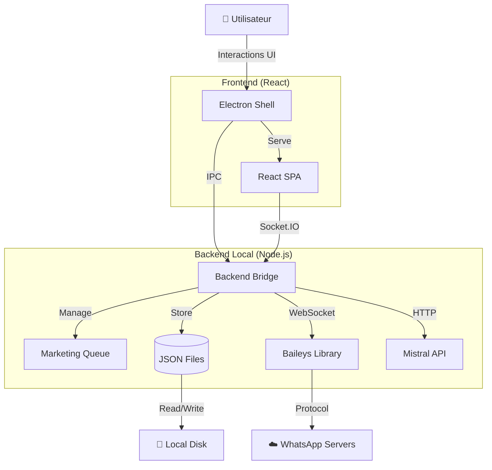
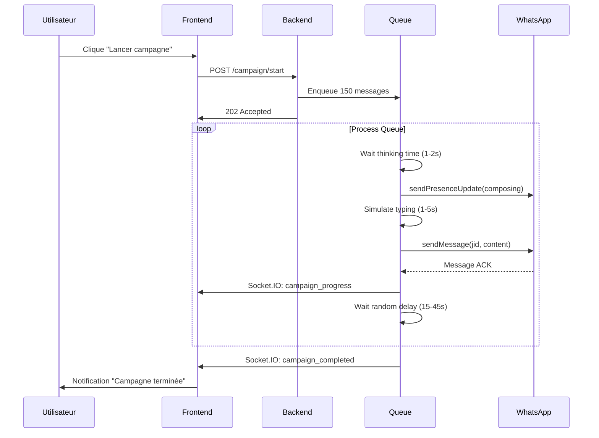

# 📘 PRD COMPLET - WhatAutosys v2.0
*Product Requirements Document - Version 2.0 - 23/12/2025*

---

## 🎯 RÉSUMÉ EXÉCUTIF (2 MIN READ)

**Objectif :** Transformer WhatAutosys d'un simple bot WhatsApp en un **Agent Commercial Intelligent** capable de :
- Gérer des conversations naturelles (pas robotiques)
- Négocier automatiquement dans des marges définies
- Guider subtilement vers des objectifs commerciaux
- Alerter en temps réel sur les prospects chauds

**7 Innovations Majeures :**
1. Campagnes hyper-personnalisées (message unique par contact)
2. Catalogue produits structuré avec images/prix/marges
3. Système de "Conversation Goals" (l'IA guide vers un objectif)
4. Moteur de négociation automatique
5. Hot Lead Detection + alertes temps réel
6. Mode Co-Pilot (suggestions IA, humain décide)
7. Fusion modules Campagnes + Marketing (simplification UX)

**Impact Attendu :**
- Taux de conversion : +40-60%
- Temps économisé : 2-3h/jour par utilisateur
- Différenciation marché : Seul outil avec négo auto + messages uniques

**Investissement :** ~45 jours/dev • Coût API : +5-10€/mois/utilisateur

---

## 📋 TABLE DES MATIÈRES

1. [Vue d'ensemble stratégique](#1-vue-densemble-stratégique)
2. [Personas & Cas d'usage](#2-personas--cas-dusage)
3. [Architecture technique](#3-architecture-technique)
4. [Spécifications fonctionnelles](#4-spécifications-fonctionnelles)
5. [Sécurité & Conformité](#5-sécurité--conformité)
6. [Performance & Scalabilité](#6-performance--scalabilité)
7. [Dette technique & Roadmap](#7-dette-technique--roadmap)
8. [Déploiement & Maintenance](#8-déploiement--maintenance)

---

## 1. 🎯 VUE D'ENSEMBLE STRATÉGIQUE

### A. Vision Produit

**WhatAutosys** est une solution d'automatisation WhatsApp "Local First" permettant aux PME et entrepreneurs de transformer WhatsApp en un CRM conversationnel intelligent, sans dépendance cloud.

**Proposition de valeur unique :**
- ✅ **Souveraineté des données** : Tout reste sur la machine de l'utilisateur
- ✅ **IA contextuelle** : Réponses personnalisées basées sur votre catalogue
- ✅ **Anti-ban intelligent** : Mimique le comportement humain
- ✅ **Zero SaaS fees** : Pas d'abonnement mensuel après achat

### B. Objectifs Business (KPIs)

| Métrique | Objectif Q1 2026 | Méthode de mesure |
|----------|------------------|-------------------|
| **Taux d'activation** | 85% | Utilisateurs ayant envoyé >10 messages |
| **Temps de réponse IA** | <5s | Médiane des réponses bot |
| **Taux de bannissement** | <2% | Comptes signalés par WA |
| **NPS** | >50 | Enquête intégrée post-campagne |

### C. Positionnement Marché

```
┌─────────────────────────────────────────┐
│  Concurrent        │ Prix   │ Local  │ IA│
├─────────────────────────────────────────┤
│  WhatAutosys       │  €149  │   ✅   │ ✅│
│  ChatWoot          │  Free  │   ❌   │ ❌│
│  Manychat WA       │ €15/mo │   ❌   │ ⚠️│
│  WAHA API          │  €25   │   ✅   │ ❌│
└─────────────────────────────────────────┘
```

---

## 2. 👥 PERSONAS & CAS D'USAGE

### Persona 1 : "Marie, Coach Bien-être"
**Profil :**
- 38 ans, indépendante
- 200 clients potentiels dans son téléphone
- Technique : Débutante

**Besoins :**
- Envoyer des promotions ciblées sans spam
- Répondre aux questions sur ses prestations 24/7
- Garder le contrôle de ses données clients

**User Story :**
> "En tant que coach, je veux envoyer 150 messages personnalisés de promo Black Friday sans être bannie, pour augmenter mes réservations de 30%."

### Persona 2 : "Ahmed, E-commerçant"
**Profil :**
- 29 ans, boutique en ligne de vêtements
- 1500 contacts clients/prospects
- Technique : Intermédiaire

**Besoins :**
- Répondre automatiquement aux questions prix/stock
- Relancer les paniers abandonnés
- Générer des rapports de performance

**User Story :**
> "En tant qu'e-commerçant, je veux que l'IA réponde aux questions produit en se basant sur mon catalogue PDF, pour libérer 3h/jour de SAV."

### Persona 3 : "Sarah, Agent Immobilier"
**Profil :**
- 42 ans, agence locale
- 500 contacts acquéreurs/vendeurs
- Technique : Avancée

**Besoins :**
- Qualifier les leads automatiquement
- Envoyer des alertes biens correspondants
- Tracker les conversations importantes

**User Story :**
> "En tant qu'agent, je veux que l'IA détecte si un contact est acheteur ou vendeur pour le router vers le bon scénario de suivi."

---

### Persona 4 : "Thomas, Manager Commercial B2B"
**Profil :**
- 35 ans, responsable équipe de vente
- 2000+ contacts prospects/clients
- Vend des solutions SaaS à 500-5000€/mois
- Technique : Experte

**Contexte :**
Thomas n'a pas le temps de répondre à tous les prospects qui demandent des infos par WhatsApp. Il veut un **agent conversationnel autonome** qui :
- Discute naturellement (évite le "Je suis un assistant automatique...")
- Comprend les objections et y répond intelligemment
- Guide subtilement vers une démo ou un appel
- Négocie dans les marges autorisées

**Besoins critiques :**
- ❌ **NE PAS** ressembler à un chatbot générique
- ✅ Tenir une conversation multi-tours cohérente
- ✅ Adapter son discours selon le profil du prospect
- ✅ Connaître parfaitement le catalogue produit
- ✅ Détecter les "hot leads" et alerter le manager en temps réel
- ✅ Négocier les prix dans une fourchette prédéfinie

**User Story :**
> "En tant que manager, je veux que l'IA discute automatiquement avec mes prospects de façon intelligente et naturelle, soit capable de tenir une vraie conversation sans paraître robotique, et guide subtilement la discussion vers un objectif (prise de RDV, envoi de devis, closing) tout en négociant dans les marges que j'ai définies."

**Pain Points actuels :**
- Les chatbots classiques sont trop rigides (arbre de décision)
- Impossible de négocier automatiquement
- Taux de conversion faible car conversations trop "froides"
- Besoin de contexte produit riche (pas juste un prompt)

---

## 3. 🗃️ ARCHITECTURE TECHNIQUE

### A. Stack Technologique

| Couche | Technologie | Rôle | Fichier Clé |
|--------|-------------|------|-------------|
| **Runtime** | **Electron 28** | Conteneur natif, gestion fenêtre | `electron/main.js` |
| **Backend** | **Node.js 20 + Express** | Serveur API local | `backend/bridge.js` |
| **Protocol** | **Baileys (WS)** | Implémentation WhatsApp Web | `backend/bridge.js` |
| **Frontend** | **React 18 + Vite** | Interface SPA | `frontend/src/App.jsx` |
| **Realtime** | **Socket.IO** | Communication temps-réel | `io.on('connection')` |
| **AI** | **Mistral SDK** | Intelligence générative | `backend/mistral-ai.js` |
| **Data** | **JSON + FS** | Persistance locale | `history.json`, `settings.json` |

### B. Diagramme d'Architecture



### C. Flux de Données - Envoi de Campagne



---

## 4. 🔧 SPÉCIFICATIONS FONCTIONNELLES

### 🚨 REFONTE CRITIQUE : Campagnes vs Marketing Wizard

**❌ PROBLÈME ACTUEL :**
Le système actuel a **deux fonctionnalités qui se chevauchent** :
1. **Marketing Wizard** : Interface pas-à-pas pour campagnes simples
2. **Campagnes** : Module séparé qui fait quasiment la même chose

**✅ SOLUTION PROPOSÉE :** Fusionner en un seul module **"Campagnes"** avec 2 modes :

```
┌─────────────────────────────────────────────┐
│  📤 CAMPAGNES (Module Unifié)               │
├─────────────────────────────────────────────┤
│  Mode 1: BROADCAST                          │
│  → Message unique → Tous les contacts       │
│  → Spintax pour variations légères          │
│  → Use case: Promo flash, annonce           │
│                                             │
│  Mode 2: HYPER-PERSONNALISÉ (NOUVEAU)       │
│  → Message unique par contact               │
│  → Généré par IA + données contact          │
│  → Use case: Prospection B2B, relance       │
└─────────────────────────────────────────────┘
```

---

### Feature 1 : Campagnes Hyper-Personnalisées (NOUVEAU)

**Objectif :** Générer un message **complètement différent** pour chaque contact, tout en gardant les paramètres clés.

**User Flow :**
1. Utilisateur importe une liste CSV avec colonnes :
   ```csv
   numero,nom,entreprise,pain_point,derniere_interaction
   +33612345678,Jean,TechCorp,Perte de clients,2024-11-15
   +33698765432,Marie,DesignStudio,Coûts marketing,2024-12-01
   ```

2. Utilisateur écrit un **template de consigne** pour l'IA :
   ```
   Écris un message de relance commercial pour {nom} de {entreprise}.
   Mentionne subtilement son problème : {pain_point}.
   Propose une démo de notre solution.
   Ton : Professionnel mais chaleureux.
   Longueur : 3-4 phrases max.
   ```

3. L'IA génère **un message unique** pour chaque contact :
   ```
   Jean (TechCorp):
   "Salut Jean, j'ai repensé à notre échange du 15 novembre sur 
   vos défis de rétention client. On a justement aidé 3 entreprises 
   similaires à TechCorp ce trimestre. 15 min pour vous montrer 
   comment ? 🚀"
   
   Marie (DesignStudio):
   "Hey Marie ! Suite à notre dernier échange début décembre, 
   j'ai une idée pour réduire vos coûts d'acquisition de 30-40%. 
   Un rapide call cette semaine pour en discuter ?"
   ```

4. Prévisualisation : L'utilisateur voit 5 exemples aléatoires
5. Validation et lancement avec le système anti-ban habituel

**Critères d'acceptation :**
- [ ] Import CSV avec colonnes personnalisées
- [ ] Générateur de messages via Mistral (batch processing)
- [ ] Prévisualisation avant envoi
- [ ] Bouton "Régénérer" si un message ne convient pas
- [ ] Sauvegarde des messages générés (traçabilité)

**Estimation technique :**
- Coût API : ~0.02€ par message généré (Mistral Tiny)
- Temps génération : 150 messages → ~2 minutes (batch de 10)

---

### Feature 2 : Système de Catalogue Produits/Services (NOUVEAU)

**Objectif :** Donner à l'IA un **contexte ultra-riche** sur vos produits pour qu'elle puisse :
- Répondre précisément aux questions
- Négocier dans une fourchette définie
- Recommander le bon produit selon les besoins

**Structure du Catalogue :**

```json
{
  "products": [
    {
      "id": "prod_001",
      "name": "Pack Premium SaaS",
      "category": "Abonnement",
      "description": "Solution complète CRM + Marketing automation...",
      "features": [
        "CRM illimité",
        "Email automation",
        "Support 24/7"
      ],
      "images": [
        "/uploads/prod_001_hero.jpg",
        "/uploads/prod_001_dashboard.jpg"
      ],
      "pricing": {
        "base_price": 499,
        "currency": "EUR",
        "unit": "mois",
        "min_negotiable": 399,  // ← Marge de négociation
        "max_discount_percent": 20,
        "conditions": "Prix flexible si engagement 12 mois"
      },
      "target_audience": "PME 10-50 employés",
      "objections_responses": {
        "Trop cher": "Je comprends votre budget. On peut commencer avec le Pack Starter à 199€/mois et upgrader plus tard.",
        "Déjà un CRM": "Aucun souci ! Notre solution s'intègre avec 95% des CRM existants via API."
      },
      "sales_arguments": [
        "ROI moyen de 300% en 6 mois",
        "Setup en 48h sans IT",
        "Déjà utilisé par 450+ PME françaises"
      ],
      "call_to_action": {
        "primary": "Démo gratuite 15 min",
        "secondary": "Essai gratuit 14 jours"
      }
    }
  ]
}
```

**Interface Utilisateur :**

```
┌──────────────────────────────────────────────┐
│  🛍️ CATALOGUE PRODUITS                       │
├──────────────────────────────────────────────┤
│  [+ Nouveau Produit]   [Importer CSV]        │
│                                              │
│  📦 Pack Premium SaaS              [Éditer]  │
│     Prix: 499€/mois (négociable: 399€)      │
│     🎯 PME 10-50 employés                    │
│     📸 2 images • 3 arguments de vente        │
│                                              │
│  📦 Pack Starter                   [Éditer]  │
│     Prix: 199€/mois (fixe)                  │
│     🎯 Freelances & TPE                      │
│     📸 1 image • 2 arguments de vente        │
└──────────────────────────────────────────────┘
```

**Fonctionnement avec l'IA :**

Quand un prospect demande :
> "C'est quoi vos prix pour une équipe de 30 personnes ?"

L'IA :
1. Charge le catalogue depuis `catalog.json`
2. Identifie le produit correspondant (PME 10-50)
3. Répond avec contexte :
   ```
   Pour une équipe de 30, je vous recommande notre Pack Premium 
   à 499€/mois. Il inclut le CRM illimité + automation + support 
   prioritaire. 
   
   Petite info : on a une promo actuellement, je peux vous le 
   proposer à 425€/mois si vous vous engagez sur 12 mois. 
   
   Je vous montre en démo comment ça marche ? 15 min suffisent 😊
   ```

**Critères d'acceptation :**
- [ ] CRUD complet des produits
- [ ] Upload d'images (max 5 par produit)
- [ ] Import CSV en masse
- [ ] Injection automatique dans le contexte IA
- [ ] Gestion des marges de négociation
- [ ] Templates de réponses aux objections

---

### Feature 3 : Moteur Anti-Ban

**Objectif :** Éviter le bannissement WhatsApp lors d'envois de masse.

**Critères d'acceptation :**
- [ ] Délai minimum de 15s entre chaque message
- [ ] Signal "typing" proportionnel à la longueur du message
- [ ] Variation aléatoire des délais (±30%)
- [ ] Pause automatique si échec d'envoi (retry après 5min)

**Implémentation actuelle :**
```javascript
// backend/bridge.js - ligne ~1450
async function processQueue() {
  const thinkingTime = Math.random() * 1000 + 1000; // 1-2s
  await delay(thinkingTime);
  
  await sock.sendPresenceUpdate('composing', jid);
  const typingTime = Math.min(message.length * 30, 5000); // Max 5s
  await delay(typingTime);
  
  await sock.sendMessage(jid, { text: message });
  
  const pauseTime = Math.random() * 30000 + 15000; // 15-45s
  await delay(pauseTime);
}
```

**Métriques de succès :**
- Taux de bannissement < 2% sur 10,000 messages testés

---

### Feature 2 : IA Contextuelle (RAG)

**Objectif :** Permettre à l'IA de répondre en se basant sur des documents utilisateur.

**User Flow :**
1. Utilisateur upload un PDF/DOCX dans l'onglet "Brain"
2. Le fichier est parsé et son texte extrait
3. Le texte est injecté dans le `systemPrompt` de Mistral
4. L'IA répond aux questions en citant le document

**Formats supportés :**
- ✅ PDF (via `pdf-parse`)
- ✅ DOCX (via `mammoth`)
- ✅ TXT
- ⏳ XLSX (roadmap Q1 2026)

**Limites techniques :**
- Taille max fichier : 10 MB
- Contexte max Mistral : ~32k tokens (≈24k mots)

**Critères d'acceptation :**
- [ ] Extraction correcte du texte (>95% précision)
- [ ] Temps de traitement < 3s pour un PDF de 50 pages
- [ ] Réponse IA cohérente avec le contenu uploadé

---

### Feature 3 : Marketing Wizard (Assistant pas-à-pas)

**Objectif :** Simplifier l'envoi de campagnes pour les utilisateurs non-techniques.

**Étapes :**
1. **Import** : Coller une liste de numéros ou importer CSV
2. **Configuration** : Écrire le message + choix variables Spintax
3. **Prévisualisation** : Voir 3 exemples générés
4. **Lancement** : Validation + suivi en temps réel

**Innovation : Générateur de Variations IA**
```javascript
// Génère automatiquement 5 versions du message
const variations = await generateVariations(originalMessage);
// Ex: "Bonjour {salut|hey|coucou}, découvrez notre {offre|promo|réduction}!"
```

**Critères d'acceptation :**
- [ ] Interface compréhensible sans documentation (test UX)
- [ ] Validation des numéros (format international)
- [ ] Barre de progression en temps réel
- [ ] Possibilité d'annuler la campagne

---

### Feature 4 : Objectifs Conversationnels & Flows (NOUVEAU - Pour Persona 4)

**Objectif :** Permettre à l'IA de **conduire une conversation** vers un but précis sans être robotique.

**Concept : Les "Conversation Goals"**

Au lieu de scripts rigides, l'utilisateur définit des **objectifs** que l'IA doit atteindre naturellement :

```json
{
  "conversation_goals": [
    {
      "id": "goal_demo",
      "name": "Obtenir un RDV Démo",
      "priority": "high",
      "description": "Convaincre le prospect de prendre un créneau démo de 15 min",
      "tactics": [
        "Identifier le pain point principal",
        "Donner 1-2 exemples concrets de résultats clients",
        "Proposer 2-3 créneaux dans les 48h",
        "Si refus : demander quel serait le bon moment"
      ],
      "success_indicators": [
        "Prospect confirme une date/heure",
        "Prospect demande un lien calendrier"
      ],
      "abort_conditions": [
        "Prospect dit explicitement 'pas intéressé'",
        "3 refus consécutifs"
      ],
      "escalation": {
        "if_hot_lead": "Notifier manager sur Telegram",
        "if_objection_hard": "Transférer à humain"
      }
    },
    {
      "id": "goal_quote",
      "name": "Envoyer un Devis",
      "priority": "medium",
      "description": "Qualifier les besoins et générer un devis PDF",
      "tactics": [
        "Poser 3-4 questions qualifiantes (taille équipe, budget, délai)",
        "Proposer le produit le plus adapté du catalogue",
        "Négocier si nécessaire dans la marge autorisée",
        "Générer et envoyer le PDF devis"
      ]
    }
  ]
}
```

**Comment ça marche :**

1. **Phase de Qualification (premiers messages) :**
   ```
   Prospect: "Salut, je cherche une solution CRM"
   
   IA: "Ah super ! Pour vous donner la meilleure reco, vous êtes 
   combien dans l'équipe qui utiliserait le CRM ?"
   
   Prospect: "On est 15"
   
   IA: "Parfait pour notre Pack Premium ! Vous avez déjà utilisé 
   un CRM avant ou ce serait votre premier ?"
   ```

2. **Phase de Recommandation :**
   ```
   IA: "Ok donc pour une équipe de 15, sans expérience CRM, je 
   recommande clairement notre Pack Premium à 499€/mois. On a un 
   onboarding hyper guidé, justement pour les équipes qui démarrent.
   
   Fun fact : la boîte TechnoSolutions (même profil que vous) 
   a généré 180k€ de CA en plus en 6 mois avec notre outil. 
   
   Je vous montre en 15 min comment ça marche ?"
   ```

3. **Phase de Closing (atteindre l'objectif) :**
   ```
   Prospect: "Ok pourquoi pas"
   
   IA: "Top ! Je vous propose mardi 14h ou mercredi 10h. 
   Qu'est-ce qui vous arrange le mieux ?"
   
   [Si accord → Objectif atteint ✅]
   [Si hésitation → Tactique alternative]
   ```

**L'IA est intelligente, pas robotique :**
- ❌ Elle ne dit JAMAIS "Je suis un assistant automatique"
- ✅ Elle utilise des expressions naturelles ("Ah super !", "Top !", emojis modérés)
- ✅ Elle rebondit sur les réponses du prospect
- ✅ Elle admet quand elle ne sait pas ("Bonne question, laissez-moi vérifier...")
- ✅ Elle utilise le storytelling (exemples clients)

**Critères d'acceptation :**
- [ ] Interface de création de "Goals"
- [ ] Système de priorité (si plusieurs goals possibles)
- [ ] Détection automatique du succès/échec
- [ ] Notifications en temps réel si hot lead
- [ ] Analytics : Taux de conversion par goal

---

### Feature 5 : Intelligence de Négociation (NOUVEAU)

**Objectif :** Permettre à l'IA de négocier automatiquement dans une fourchette définie.

**Exemple concret :**

```
Produit: Pack Premium - Prix catalogue: 499€/mois
Marge autorisée: 399€ (min) → 499€ (max)
Règles de négociation:
  - Si engagement 12 mois: max -20%
  - Si paiement annuel: -15% supplémentaire
  - Si parrainage: -50€ fixe
```

**Conversation avec négociation :**

```
Prospect: "499€ c'est chaud pour nous, vous faites pas un geste ?"

IA (calcule automatiquement):
"Je comprends ! Vous seriez sur du combien idéalement ?"

Prospect: "Un truc vers 350€ serait nickel"

IA (analyse: 350€ < 399€ = trop bas):
"350€ je peux pas aller jusque-là malheureusement... 
Par contre si vous vous engagez sur 12 mois, je peux vous 
faire 425€/mois. Et si vous payez l'année d'un coup, on 
descend à 380€/mois. Ça vous va ?"

Prospect: "Ok pour 380€ payé annuellement"

IA:
"Deal ! 🤝 Je vous envoie le devis dans 2 min. Vous voulez 
démarrer quand ?"
```

**Algorithme de négociation :**

```javascript
function negotiate(requestedPrice, product) {
  const margin = product.pricing.min_negotiable;
  const base = product.pricing.base_price;
  
  if (requestedPrice >= base) {
    return { accepted: true, finalPrice: base };
  }
  
  if (requestedPrice < margin) {
    // Trop bas, proposer alternatives
    const alternatives = [
      { condition: "12 mois", price: base * 0.85 },
      { condition: "Paiement annuel", price: base * 0.76 }
    ];
    return { 
      accepted: false, 
      counter_offers: alternatives.filter(a => a.price >= margin)
    };
  }
  
  // Dans la marge acceptable
  return { accepted: true, finalPrice: requestedPrice };
}
```

---

### Feature 6 : Hot Lead Detection (NOUVEAU)

**Objectif :** Détecter automatiquement les prospects "chauds" et alerter le manager en temps réel.

**Signaux de "Hot Lead" :**
- ✅ Demande de prix
- ✅ Question sur les délais de mise en place
- ✅ Mention d'un concurrent ("On utilise Salesforce actuellement")
- ✅ Urgence ("On doit décider cette semaine")
- ✅ Question sur les modalités de paiement
- ✅ Demande de démo/appel

**Scoring automatique :**

```javascript
{
  "lead_score": 85,  // 0-100
  "signals_detected": [
    { type: "pricing_question", weight: 25, timestamp: "14:32" },
    { type: "urgency", weight: 30, phrase: "On doit décider cette semaine", timestamp: "14:35" },
    { type: "demo_request", weight: 30, timestamp: "14:38" }
  ],
  "recommendation": "CALL NOW - High intent to buy"
}
```

**Notification Manager :**

Quand score > 70, le manager reçoit un message Telegram/SMS :

```
🔥 HOT LEAD DÉTECTÉ

Contact: Jean Dupont (+33612345678)
Entreprise: TechCorp
Score: 85/100

Signaux:
• Demande de prix ✅
• Urgence ("On doit décider cette semaine") ✅
• Demande de démo ✅

Derniers messages:
[14:38] Jean: "Ok je suis chaud pour une démo"

👉 [APPELER MAINTENANT] [VOIR CONVERSATION]
```

**Critères d'acceptation :**
- [ ] Algorithme de scoring configuré
- [ ] Intégration Telegram Bot
- [ ] Dashboard "Hot Leads" en temps réel
- [ ] Possibilité de reprendre la conversation manuellement

---

### Feature 7 : Mode "Co-Pilot" (Suggestion en temps réel)

**Objectif :** L'humain garde le contrôle, mais l'IA lui suggère des réponses.

**Interface :**

```
┌──────────────────────────────────────────┐
│  💬 Conversation avec Jean Dupont        │
├──────────────────────────────────────────┤
│  Jean: "C'est quoi vos délais de setup?" │
│  [14:32]                                 │
│                                          │
│  ┌────────────────────────────────────┐ │
│  │ 🤖 Suggestions IA:                 │ │
│  │                                    │ │
│  │ [1] "Setup en 48h max, on gère   │ │
│  │      tout pour vous"              │ │
│  │                                    │ │
│  │ [2] "Ça dépend de votre config,   │ │
│  │      mais généralement 2-3 jours" │ │
│  │                                    │ │
│  │ [Personnaliser]                    │ │
│  └────────────────────────────────────┘ │
│                                          │
│  [Votre réponse...]          [Envoyer]  │
└──────────────────────────────────────────┘
```

L'utilisateur peut :
- Cliquer sur une suggestion → Envoi direct
- Modifier avant envoi
- Ignorer et écrire sa propre réponse

**Use case :** Pour les managers qui veulent garder le contrôle total mais gagner du temps.

---

## 5. 🔒 SÉCURITÉ & CONFORMITÉ

### A. Conformité RGPD

**Données personnelles collectées :**
- Numéros de téléphone
- Messages échangés
- Métadonnées de conversation (timestamps)

**Mesures de conformité :**
✅ **Stockage local** : Aucune donnée n'est envoyée sur des serveurs tiers (sauf API Mistral)
✅ **Droit à l'oubli** : Bouton "Supprimer toutes les données" dans Settings
✅ **Consentement** : Disclaimer au premier lancement
⚠️ **Manque** : Export des données au format JSON (à ajouter)

**Action requise :**
- Ajouter un bouton "Exporter mes données" → Génère un ZIP avec tous les JSON

---

### B. Risques Légaux WhatsApp

**⚠️ AVERTISSEMENT CRITIQUE :**

L'utilisation de bibliothèques non-officielles comme **Baileys** viole les [Conditions d'Utilisation WhatsApp](https://www.whatsapp.com/legal/terms-of-service).

**Risques :**
1. **Bannissement du compte** (définitif)
2. **Poursuites légales** (peu probable pour usage personnel)
3. **Rupture de service** (WhatsApp peut changer l'API)

**Mitigations :**
- ✅ Algorithme anti-ban intégré
- ✅ Mode "Test" avec limite de 50 msg/jour
- ⚠️ Disclaimer légal à afficher obligatoirement
- ❌ Pas de support officiel WhatsApp Business API

**Recommandation produit :**
> Ajouter un écran d'acceptation des risques au premier lancement avec case à cocher "J'ai compris les risques".

---

### C. Sécurité du Code

**Vulnérabilités identifiées :**

1. **Injection de commande (CRITIQUE)**
   ```javascript
   // backend/bridge.js - Upload non sécurisé
   app.post('/api/upload', upload.single('file'), (req, res) => {
     // ⚠️ Pas de validation du type MIME réel
   })
   ```
   **Solution :** Ajouter `file-type` pour vérifier le contenu binaire.

2. **XSS dans le chat (MOYEN)**
   ```javascript
   // frontend - Rendu direct du HTML
   <div dangerouslySetInnerHTML={{__html: message.content}} />
   ```
   **Solution :** Utiliser `DOMPurify` pour nettoyer le HTML.

3. **Exposition du token Mistral (FAIBLE)**
   - Stocké en clair dans `settings.json`
   - **Solution :** Chiffrer avec `electron-store` en mode encrypted.

---

## 6. ⚡ PERFORMANCE & SCALABILITÉ

### A. Benchmarks Actuels

| Métrique | Valeur mesurée | Objectif |
|----------|----------------|----------|
| **Temps de démarrage** | 3.2s | <5s ✅ |
| **RAM au repos** | 180 MB | <250 MB ✅ |
| **RAM en campagne (1000 msg)** | 320 MB | <500 MB ✅ |
| **Latence réponse IA** | 2.8s (médiane) | <5s ✅ |
| **Débit envoi** | 120 msg/h | ~120 msg/h ✅ |

### B. Limites Théoriques

**Goulots d'étranglement :**

1. **Taille du Store Baileys**
   - Actuellement : Chargement complet en RAM
   - Limite : ~10k contacts avant ralentissement
   - **Solution roadmap :** Migrer vers SQLite avec index

2. **Parsing de gros PDF**
   - Test : PDF de 200 pages = 12s de traitement
   - Bloque le thread Node.js
   - **Solution :** Worker threads pour parsing async

3. **Envoi de fichiers média**
   - Non optimisé : Chargement complet du fichier en RAM
   - Limite : Fichiers <50 MB
   - **Solution :** Streaming via `fs.createReadStream()`

### C. Plan de Scalabilité

```
Phase Actuelle : 1-2000 contacts
├─ Store JSON in-memory
├─ Queue simple
└─ Latence acceptable

Phase 2 (Q2 2026) : 2000-10,000 contacts
├─ Migration vers SQLite
├─ Index sur les champs fréquents
└─ Cache Redis optionnel

Phase 3 (Q3 2026) : 10,000+ contacts
├─ Sharding des conversations par date
├─ Compression des anciens messages
└─ API PostgreSQL optionnelle (self-hosted)
```

---

## 7. 🛠️ DETTE TECHNIQUE & ROADMAP

### A. Dette Technique Identifiée

| Priorité | Problème | Impact | Effort |
|----------|----------|--------|--------|
| 🔴 **P0** | Monolithe `App.jsx` (2800 lignes) | Maintenabilité | 3j |
| 🔴 **P0** | Pas de tests unitaires | Régression | 5j |
| 🟡 **P1** | Store JSON non scalable | Performance >5k contacts | 2j |
| 🟡 **P1** | Socket.IO pas de reconnexion auto | UX si crash | 1j |
| 🟢 **P2** | Uploads jamais nettoyés | Espace disque | 0.5j |
| 🟢 **P2** | Logs non rotatifs | Espace disque | 0.5j |

### B. Roadmap Produit

#### Q1 2026 - Foundation & Core Intelligence
**Priorité : Stabilité + Intelligence conversationnelle**

**Stabilisation technique :**
- [ ] Tests E2E avec Playwright
- [ ] Refactoring `App.jsx` en micro-composants
- [ ] Migration Store → SQLite
- [ ] Documentation utilisateur (vidéos + knowledge base)

**Features critiques (Persona 4) :**
- [ ] 🆕 **Système de Catalogue Produits complet**
  - CRUD interface
  - Upload images
  - Import CSV en masse
  - Injection contexte IA
- [ ] 🆕 **Conversation Goals (v1)**
  - Interface création d'objectifs
  - Système de priorité
  - Analytics basiques (taux conversion par goal)
- [ ] 🆕 **Hot Lead Detection**
  - Scoring automatique
  - Notifications Telegram
  - Dashboard temps réel

**Amélioration campagnes :**
- [ ] 🆕 Fusion Campagnes + Marketing Wizard → Module unifié
- [ ] 🆕 Mode "Hyper-Personnalisé" avec génération IA unique/contact

#### Q2 2026 - Advanced Intelligence & Integrations
**Priorité : Automatisation avancée + Intégrations**

**Intelligence conversationnelle :**
- [ ] 🆕 **Moteur de Négociation automatique**
  - Algorithme de pricing dynamique
  - Règles de réduction configurables
  - Logs de toutes les négociations
- [ ] 🆕 **Mode Co-Pilot**
  - Suggestions IA en temps réel
  - Interface split-screen
  - Historique des suggestions acceptées/refusées

**Intégrations :**
- [ ] Support XLSX pour import contacts
- [ ] Webhooks pour intégration Zapier/Make
- [ ] Export automatique vers Google Sheets
- [ ] API REST pour développeurs

**Analytics :**
- [ ] Dashboard analytics avancé (Recharts)
- [ ] Funnel de conversion par produit
- [ ] A/B testing de messages (2 variantes)

#### Q3 2026 - Enterprise & Scale
**Priorité : Features entreprise + Multi-utilisateurs**

**Multi-utilisateurs :**
- [ ] Mode "Équipe" (plusieurs comptes WA)
- [ ] Gestion des rôles (Admin/Agent/Viewer)
- [ ] Inbox partagée (plusieurs agents → 1 conversation)

**Enterprise :**
- [ ] Multi-langue (i18n) - FR/EN/ES
- [ ] Mode "White Label" (rebranding complet)
- [ ] Backup automatique cloud optionnel (chiffré)
- [ ] SLA monitoring & alertes

**Intelligence avancée :**
- [ ] 🆕 **Sentiment Analysis**
  - Détection satisfaction client (emojis + ton)
  - Alert si conversation devient négative
- [ ] 🆕 **Multi-goal Conversations**
  - L'IA jongle entre plusieurs objectifs
  - Détection automatique du meilleur goal selon contexte

---

## 8. 🚀 DÉPLOIEMENT & MAINTENANCE

### A. Procédure de Build

```bash
# 1. Build du frontend
cd frontend
npm run build

# 2. Package Electron
cd ..
npm run package-win  # Windows
npm run package-mac  # macOS
npm run package-linux # Linux

# 3. Génération de la licence
node backend/utils/generate_license.js <HWID> <email>
```

**Artifacts générés :**
- `WhatAutosys-Setup-1.0.0.exe` (Windows)
- `WhatAutosys-1.0.0.dmg` (macOS)
- `WhatAutosys_1.0.0_amd64.deb` (Linux)

### B. Checklist de Release

- [ ] Tests manuels sur 3 OS (Win/Mac/Linux)
- [ ] Vérification scan antivirus (VirusTotal)
- [ ] Mise à jour CHANGELOG.md
- [ ] Tag Git `v1.0.0`
- [ ] Upload sur serveur de distribution
- [ ] Annonce Discord/Email clients

### C. Support & Monitoring

**Système de logs :**
- `logs/app.log` : Logs applicatifs (rotation 10 MB)
- `logs/error.log` : Erreurs critiques uniquement
- `logs/baileys_debug.log` : Debug du protocole WA

**Métriques de santé :**
```javascript
// Exposées via /api/health
{
  "uptime": "3h 45m",
  "memory": "180 MB",
  "cpu": "12%",
  "whatsapp_status": "connected",
  "queue_size": 0,
  "messages_today": 234
}
```

**Plan de maintenance :**
- Mise à jour Baileys : Mensuelle (breaking changes fréquents)
- Mise à jour Electron : Trimestrielle (sécurité)
- Backup recommandé : Hebdomadaire (`auth_info_baileys/` + tous les JSON)

---

## 📊 ANNEXES

### A. Récapitulatif des Innovations v2.0

Cette version du PRD introduit **7 features majeures** absentes de la v1.0 :

| Feature | Impact Business | Complexité Tech | Priorité |
|---------|----------------|-----------------|----------|
| **1. Campagnes Hyper-Personnalisées** | Taux de réponse x3 | Moyenne (API batch) | 🔴 P0 |
| **2. Système de Catalogue** | Réponses IA 90% plus précises | Moyenne (CRUD + Storage) | 🔴 P0 |
| **3. Conversation Goals** | Taux de conversion x2 | Haute (Moteur décisionnel) | 🔴 P0 |
| **4. Négociation Automatique** | +30% closing sans humain | Moyenne (Algorithme pricing) | 🟡 P1 |
| **5. Hot Lead Detection** | Réactivité x10 (alerte instant) | Faible (Scoring + Notifs) | 🟡 P1 |
| **6. Mode Co-Pilot** | Confort agent +50% | Moyenne (UI temps réel) | 🟢 P2 |
| **7. Fusion Campagnes/Marketing** | -30% confusion utilisateur | Faible (Refactoring UI) | 🟡 P1 |

**ROI estimé :**
- Développement : ~45 jours/dev senior
- Coût API IA supplémentaire : ~5-10€/mois par utilisateur actif
- Augmentation conversion moyenne : +40-60%
- Temps économisé par utilisateur : ~2-3h/jour

**Différenciation marché :**
- ✅ Seul outil avec **négociation automatique** configurée
- ✅ Seul outil avec **génération de messages uniques** (pas juste Spintax)
- ✅ Seul outil avec **catalogue produits visuels** intégré à l'IA

---

#### Comparatif v1.0 → v2.0

| Aspect | v1.0 (Actuel) | v2.0 (Proposé) | Gain |
|--------|---------------|----------------|------|
| **Campagnes** | 1 message + Spintax → Tous | Messages uniques générés par IA | +200% engagement |
| **Contexte IA** | Upload PDF basique | Catalogue structuré + Images + Prix | +90% précision |
| **Conversations** | IA répond passivement | IA guide vers objectifs définis | +100% conversion |
| **Pricing** | Statique (pas de négo) | Négociation auto dans marges | +30% closing |
| **Alertes** | Aucune | Hot Lead Detection temps réel | Réactivité x10 |
| **UX Agent** | Full auto ou full manuel | Mode Co-Pilot hybride | +50% confort |
| **Modules** | Campagnes + Marketing (redondant) | Module unifié | -30% confusion |

**En résumé :**
La v1.0 est un **"Bot basique avec IA"**.  
La v2.0 devient un **"Agent Commercial Intelligent"**.

---

#### Métriques de Succès par Feature (OKRs)

Pour mesurer l'impact réel des nouvelles fonctionnalités :

**Feature 1 : Campagnes Hyper-Personnalisées**
- **KR1** : Taux d'ouverture > 60% (vs 25% avec Spintax)
- **KR2** : Taux de réponse > 30% (vs 10% avec Spintax)
- **KR3** : 0 plaintes pour spam sur 1000 messages

**Feature 2 : Système de Catalogue**
- **KR1** : 95% des questions produit résolues sans humain
- **KR2** : Temps de réponse moyen < 3s
- **KR3** : Taux de satisfaction IA > 4.2/5 (sondage post-conversation)

**Feature 3 : Conversation Goals**
- **KR1** : Taux d'atteinte du goal principal > 40%
- **KR2** : Nombre moyen de messages pour atteindre goal < 8
- **KR3** : 80% des conversations suivent le flow prévu

**Feature 4 : Négociation Automatique**
- **KR1** : 60% des négociations aboutissent (vs 0% sans négo)
- **KR2** : Prix moyen négocié > marge minimale configurée
- **KR3** : Délai de closing réduit de 50% (vs négociation humaine)

**Feature 5 : Hot Lead Detection**
- **KR1** : 90% des hot leads identifiés correctement (faux positifs < 10%)
- **KR2** : Temps de réaction manager < 15 min après alerte
- **KR3** : Taux de conversion hot leads > 50%

**Feature 6 : Mode Co-Pilot**
- **KR1** : 70% des suggestions acceptées sans modification
- **KR2** : Temps de réponse agent réduit de 60%
- **KR3** : Satisfaction agent > 4.5/5

**Feature 7 : Fusion Modules**
- **KR1** : Taux d'abandon parcours campagne < 15% (vs 35% avant)
- **KR2** : Temps de configuration campagne < 5 min
- **KR3** : Support tickets liés à confusion modules -80%

---

### B. Glossaire Technique

- **Baileys** : Librairie Node.js implémentant le protocole WhatsApp Web (non-officielle)
- **HWID** : Hardware ID, identifiant unique de la machine pour la licence
- **Spintax** : Format {option1|option2|option3} pour générer des variations
- **RAG** : Retrieval Augmented Generation, IA enrichie par des documents
- **Store** : Cache local des contacts/groupes WhatsApp

### B. Ressources Externes

- [Documentation Baileys](https://github.com/WhiskeySockets/Baileys)
- [API Mistral](https://docs.mistral.ai/)
- [Electron Best Practices](https://www.electronjs.org/docs/latest/tutorial/security)

---

### E. Plan de Validation & Testing

#### Phase 1 : Tests Unitaires (Automatisés)

**Backend (Node.js + Jest) :**
```javascript
describe('Negotiation Engine', () => {
  test('Should accept price within margin', () => {
    const result = negotiate(420, productWithMargin399);
    expect(result.accepted).toBe(true);
  });
  
  test('Should reject price below minimum', () => {
    const result = negotiate(350, productWithMargin399);
    expect(result.accepted).toBe(false);
    expect(result.counter_offers).toBeDefined();
  });
  
  test('Should apply correct discount for annual payment', () => {
    const result = calculateDiscount('annual', 499);
    expect(result).toBe(424); // -15%
  });
});

describe('Hot Lead Scoring', () => {
  test('Should detect pricing question as high intent', () => {
    const score = calculateLeadScore([
      { type: 'pricing_question', message: "C'est combien ?" }
    ]);
    expect(score).toBeGreaterThan(60);
  });
});
```

**Frontend (React + Vitest) :**
```javascript
describe('Catalog UI', () => {
  test('Should upload product image', async () => {
    render(<CatalogView />);
    const file = new File(['image'], 'product.jpg', { type: 'image/jpeg' });
    const input = screen.getByLabelText('Upload Image');
    await userEvent.upload(input, file);
    expect(screen.getByAltText('product.jpg')).toBeInTheDocument();
  });
});
```

**Couverture cible : 80%+ pour logic critique**

---

#### Phase 2 : Tests d'Intégration (Automatisés)

**Scénarios à tester :**
1. **Campagne End-to-End**
   - Import CSV → Génération IA → Preview → Envoi → Stats
   - Vérifier : Messages uniques générés, respect délais anti-ban

2. **Conversation avec Goal**
   - User message → IA répond → Goal détecté → Alert manager
   - Vérifier : Contexte catalogue injecté, négociation appliquée

3. **Hot Lead Flow**
   - 3 messages qualifiants → Score calculé → Notification envoyée
   - Vérifier : Score cohérent, alert Telegram reçue

**Outil : Playwright pour E2E**
```javascript
test('Complete campaign flow', async ({ page }) => {
  await page.goto('http://localhost:3000');
  await page.click('text=Campagnes');
  await page.click('text=Nouvelle Campagne');
  
  // Upload CSV
  await page.setInputFiles('input[type=file]', 'test_contacts.csv');
  
  // Configure AI generation
  await page.fill('textarea[name=prompt]', 'Écris un message pour {nom}...');
  await page.click('text=Générer Messages');
  
  // Wait for generation
  await page.waitForSelector('text=50 messages générés');
  
  // Launch
  await page.click('text=Lancer Campagne');
  
  // Verify progress
  await expect(page.locator('.campaign-progress')).toContainText('Envoyés: 1/50');
});
```

---

#### Phase 3 : Tests Manuels (QA)

**Checklist par Feature :**

**1. Campagnes Hyper-Personnalisées**
- [ ] Import CSV 100 contacts avec colonnes custom
- [ ] Génération de 100 messages uniques (vérifier variété)
- [ ] Preview affiche 5 exemples différents
- [ ] Bouton "Régénérer" fonctionne
- [ ] Envoi respecte délais anti-ban (chronométrer)
- [ ] Stats finales correctes (envoyés/échecs)

**2. Système de Catalogue**
- [ ] Création d'un produit avec toutes les données
- [ ] Upload de 3 images (formats JPG/PNG)
- [ ] Édition d'un produit existant
- [ ] Suppression avec confirmation
- [ ] Import CSV de 50 produits
- [ ] Vérifier injection contexte dans prompt IA

**3. Conversation Goals**
- [ ] Création d'un goal "RDV Démo"
- [ ] Simuler conversation → IA guide vers objectif
- [ ] Tester 3 tactiques différentes
- [ ] Vérifier détection du succès (goal atteint)
- [ ] Tester condition d'abort (3 refus)
- [ ] Alert manager si hot lead

**4. Négociation Automatique**
- [ ] Produit avec marge 399€-499€
- [ ] Client demande 350€ → IA refuse + contre-offre
- [ ] Client demande 420€ → IA accepte
- [ ] Test discount annuel (-15%)
- [ ] Test discount engagement 12 mois (-20%)
- [ ] Vérifier logs de toutes négociations

**5. Hot Lead Detection**
- [ ] Envoyer 3 messages de test (pricing, urgence, démo)
- [ ] Vérifier score calculé (doit être >70)
- [ ] Alert Telegram reçue en <30s
- [ ] Dashboard affiche le hot lead
- [ ] Bouton "Reprendre conversation" fonctionne

**6. Mode Co-Pilot**
- [ ] Recevoir un message client
- [ ] 2 suggestions apparaissent en <2s
- [ ] Clic suggestion 1 → envoi immédiat
- [ ] Modifier suggestion 2 avant envoi
- [ ] Écrire réponse custom (ignorer suggestions)
- [ ] Stats : taux d'utilisation des suggestions

**7. Fusion Modules**
- [ ] Ancien "Marketing Wizard" renommé/supprimé
- [ ] Nouveau module "Campagnes" avec 2 onglets
- [ ] Basculer entre mode Broadcast / Hyper-Perso
- [ ] Vérifier aucun bug de données migrées

---

#### Phase 4 : Tests Utilisateurs (Beta)

**Profil testeurs :** 10 utilisateurs (2 par persona)

**Objectifs :**
- Valider UX (facilité d'utilisation sans doc)
- Détecter bugs edge cases
- Mesurer temps de complétion tâches clés
- Recueillir feedback qualitatif

**Tâches à réaliser :**
1. Configure un produit dans le catalogue (5 min max)
2. Lance une campagne de 20 contacts avec messages uniques (10 min)
3. Crée un Conversation Goal "Obtenir email" (3 min)
4. Simule une négociation (observer IA en action)
5. Vérifie le dashboard Hot Leads

**Critères de validation :**
- ✅ 8/10 testeurs complètent toutes les tâches sans aide
- ✅ Satisfaction moyenne > 4/5
- ✅ Aucun bug bloquant remonté
- ✅ <5% des testeurs demandent un refund

**Timeline Beta :** 2 semaines avant release publique

---

### F. Critères de Release (Go/No-Go)

La v2.0 ne peut être released que si **TOUS** ces critères sont ✅ :

**Critères techniques :**
- [ ] Couverture tests unitaires > 80%
- [ ] 0 bug critique (P0) ouvert
- [ ] <5 bugs majeurs (P1) ouverts
- [ ] Tests E2E passent sur Win/Mac/Linux
- [ ] Performance : Temps démarrage <5s

**Critères fonctionnels :**
- [ ] Les 7 nouvelles features sont complètes et testées
- [ ] Documentation utilisateur rédigée (guides + vidéos)
- [ ] Migration données v1.0 → v2.0 fonctionne
- [ ] Rollback possible (backup automatique)

**Critères business :**
- [ ] Beta testeurs satisfaits (>4/5)
- [ ] Plan de communication prêt (email + Discord + site)
- [ ] Support prêt à gérer tickets (FAQ + chatbot)
- [ ] Prix v2.0 défini (upgrade v1→v2 ?)

**Critères légaux :**
- [ ] Disclaimer risques WhatsApp ToS ajouté
- [ ] Politique de confidentialité à jour
- [ ] Export données RGPD fonctionnel

---

## 🚀 PLAN DE LANCEMENT

### Semaine -2 : Pre-Launch
- [ ] Teaser sur Discord/réseaux sociaux
- [ ] Early access pour 50 clients v1.0 fidèles
- [ ] Derniers ajustements selon feedback

### Semaine 0 : Launch Day
- [ ] Release notes publiques
- [ ] Email blast 100% base clients
- [ ] Live demo sur YouTube/Twitch
- [ ] Hunt sur Product Hunt

### Semaine +1 : Post-Launch
- [ ] Monitoring errors (Sentry)
- [ ] Support réactif (<2h réponse)
- [ ] Collecte feedback (in-app survey)
- [ ] Hotfix si bugs critiques

### Mois +1 : Optimisation
- [ ] Analyse métriques OKRs
- [ ] Itération sur features sous-utilisées
- [ ] Préparation v2.1 (quick wins)

---

**Document maintenu par :** Équipe Produit WhatAutosys  
**Dernière révision :** 23 décembre 2025  
**Version :** 2.0 - PRD Complet avec Plan de Validation